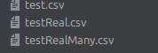

# Ivan-Barutchiyski-employees

Prerequisites
- Java 21
- Node.js & npm (latest)

In ibempapp run:
    ./mvnw spring-boot: run

In ibempfront run:
    npm start

IN ibempapp/src/main/resources there are three csv files for upload:
